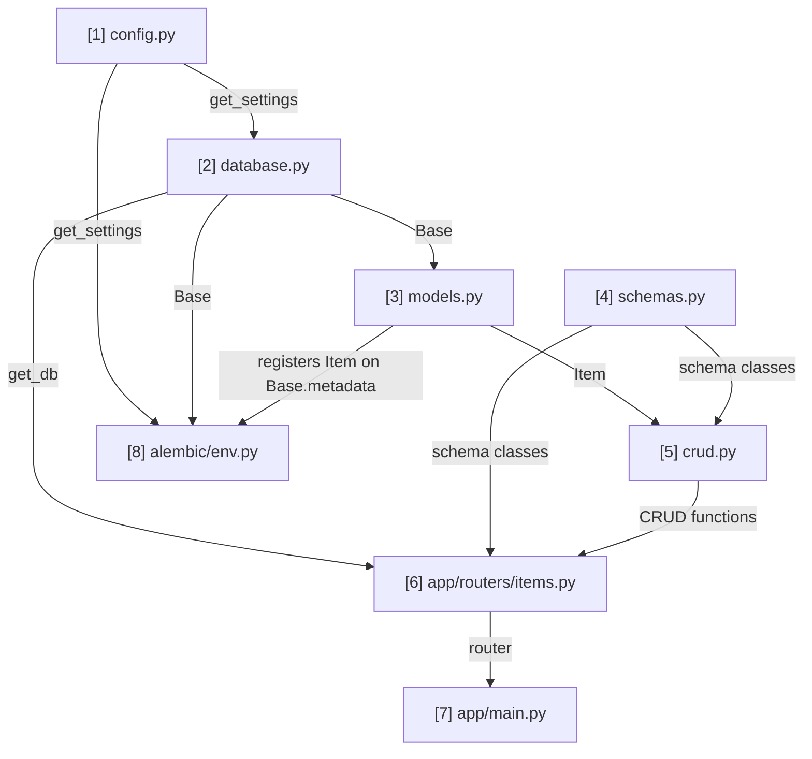

# pg-admin — Notes & Timeline

Short, plain notes on every file created, in the order it was created, plus a
timeline graph so the whole project history is visible at a glance.

## Timeline

```
[1] .gitignore
     |
     v
[2] README.md
     |
     v
[3] requirements.txt
     |
     v
[4] .env.example
     |
     v
[5] .env
     |
     v
[6] app/__init__.py
     |
     v
[7] app/core/__init__.py
     |
     v
[8] app/core/config.py
     |
     v
[9] app/core/database.py
     |
     v
[10] app/models.py
     |
     v
[11] app/schemas.py
     |
     v
[12] app/crud.py
     |
     v
[13] app/routers/__init__.py
     |
     v
[14] app/routers/items.py
     |
     v
[15] app/main.py
     |
     v
[16] alembic.ini + alembic/env.py
     |
     v
[17] app/main.py (revised: create_all() removed)
```

(No "NEXT" node queued — waiting on user direction. Likely future additions:
auth, tests.)

## Routes Graph (import / dependency connections)

This is ONE single graph covering the whole project — not the Timeline above,
and not split into multiple smaller diagrams. It only includes files that
contain real import-relevant logic (no `.gitignore`, `.env`, README,
`requirements.txt`, or empty `__init__.py` plumbing files). Every arrow means
"the file at the tail is imported by the file at the head," labeled with
*what* it imports.

The number in each node's label is this graph's own sequence number (1st,
2nd, ... file to join the import graph) — it does NOT match the Timeline
number for the same file above. Example: `config.py` is Timeline `[8]` but
Routes Graph node `1`.

This is a **Mermaid diagram** — GitHub and VS Code render it automatically as
an actual flowchart with boxes and arrows, not raw text. It's a living
document: when a new file joins the import graph, add its node and edges to
this SAME diagram in place. Never create a second Routes Graph elsewhere in
this file.



`[7] app/main.py` and `[8] alembic/env.py` have no outgoing arrows — nothing
in the project imports from them. `[4] schemas.py` has no incoming arrows —
it's a root, deliberately kept independent of the DB layer. Note:
`app/main.py` used to also import `Base`/`engine` from `database.py`, but
that edge was removed once Alembic took over schema management (see File
notes `[17]`).

## File notes

### [1] .gitignore
- Motive: keep local-only and sensitive files out of a public git repo.
- Logic: lists path patterns (`venv/`, `.env`, caches, IDE files, logs) that git
  should never stage or track.

### [2] README.md
- Motive: state what the project is and how to run it, for anyone opening the repo.
- Logic: static markdown — purpose, tech stack, setup commands. No runtime effect.

### [3] requirements.txt
- Motive: declare exact Python packages the project needs, so the environment is
  reproducible on any machine.
- Logic: plain list of package names, one per line, installed via
  `pip install -r requirements.txt`.

### [4] .env.example
- Motive: document which environment variables the app expects, without exposing
  real values.
- Logic: same variable names as `.env`, filled with placeholder values, safe to commit.

### [5] .env
- Motive: hold actual local configuration (host, port, db name, credentials) outside
  source code, so real credentials never enter version control and can differ per
  environment (local vs production).
- Logic: `KEY=VALUE` lines, read at process startup by pydantic-settings.
  Excluded from git via `.gitignore`.

### [6] app/__init__.py
- Motive: mark the `app` directory as an importable Python package.
- Logic: empty file — its presence, not its content, is what Python's import
  system checks for.

### [7] app/core/__init__.py
- Motive: same purpose as above, for the `core` subpackage, which holds
  cross-cutting infrastructure code (config, database connection, etc.).
- Logic: empty.

### [8] app/core/config.py
- Motive: centralize every environment-driven setting in one validated object,
  so no other file reads raw environment variables or hardcodes connection
  details directly.
- Logic:
  - `Settings(BaseSettings)` declares required fields with explicit types;
    pydantic-settings loads them from `.env` and validates them at startup,
    failing immediately if a value is missing or the wrong type.
  - `database_url` property combines the five separate fields into the single
    connection-string format the database driver will need.
  - `get_settings()`, wrapped in `@lru_cache`, ensures `.env` is parsed exactly
    once per process; every other file that needs settings gets the same
    cached instance instead of re-reading the file.

### [9] app/core/database.py
- Motive: create the actual connection pool to Postgres, and provide a
  controlled, per-request way for the rest of the app to borrow and return a
  database session, plus the base class every table model will inherit from.
- Logic:
  - Imports `get_settings` from `config.py` and reads `settings.database_url`
    to build `engine = create_engine(...)`, which manages a pool of reusable
    connections instead of opening a new one per request.
  - `SessionLocal = sessionmaker(...)` is a factory for creating sessions
    bound to that engine; `autocommit=False, autoflush=False` means no change
    reaches the real database until `commit()` is explicitly called.
  - `Base = declarative_base()` is the class every future table model
    (`models.py`) will inherit from, so SQLAlchemy can map it to a real table.
  - `get_db()` is a generator: creates one session, yields it, and closes it
    in a `finally` block so the connection always returns to the pool, even
    if the caller raises an exception.

### [10] app/models.py
- Motive: define the actual shape of the `items` table so SQLAlchemy can
  create it in Postgres and map rows to/from Python objects.
- Logic:
  - `class Item(Base)` inherits the declarative base from `database.py`,
    marking it as a real table blueprint; `__tablename__` sets the table's
    name in Postgres.
  - `id`: auto-incrementing primary key, indexed for fast lookups.
  - `name`: required (`nullable=False`), indexed since it's a likely search
    field.
  - `description`: optional.
  - `created_at` / `updated_at`: timestamps stamped by Postgres itself via
    `server_default=func.now()` (on insert) and `onupdate=func.now()` (on
    every update), rather than by application code.

### [11] app/schemas.py
- Motive: define the API-facing shape of an Item, kept deliberately separate
  from the database-facing shape in `models.py`, so clients can never set
  server-controlled fields (`id`, `created_at`, `updated_at`) and so create
  vs. update rules can differ (required vs. optional fields).
- Logic:
  - `ItemBase`: fields shared by create and read (`name` required,
    `description` optional).
  - `ItemCreate(ItemBase)`: exact shape accepted in a create request body.
  - `ItemUpdate(BaseModel)`: all fields optional, for partial updates;
    intentionally does not inherit `ItemBase` since required-ness differs.
  - `ItemRead(ItemBase)`: adds `id`, `created_at`, `updated_at` for
    responses; `model_config = ConfigDict(from_attributes=True)` allows
    building this schema directly from a SQLAlchemy `Item` instance instead
    of only from a plain dict.

### [12] app/crud.py
- Motive: isolate all direct database operations into small, reusable, pure
  functions, separate from any HTTP/request handling, so the same functions
  can be called from routes, scripts, or tests.
- Logic:
  - Every function takes `db: Session` as an explicit parameter rather than
    creating one internally — the caller controls the session's lifetime.
  - `get_item`: primary-key lookup via `db.get()`, returns `None` if missing
    (caller decides how to handle that, e.g. a 404).
  - `get_items`: paginated list via `offset`/`limit`, so a single call can
    never return an unbounded number of rows.
  - `create_item`: builds a `models.Item` from a validated `schemas.ItemCreate`
    (`model_dump()` + `**` unpack), stages it (`db.add`), commits it, then
    `db.refresh()`s it to pull back server-generated fields (`id`,
    timestamps).
  - `update_item`: takes an already-fetched `db_item` (finding it is the
    caller's job) and an `ItemUpdate`; `exclude_unset=True` ensures only
    fields the client actually sent are applied, so a partial update can't
    accidentally null out other fields.
  - `delete_item`: takes an already-fetched `db_item`, stages and commits
    the delete.

### [13] app/routers/__init__.py
- Motive: mark `app/routers/` as a Python package.
- Logic: empty.

### [14] app/routers/items.py
- Motive: translate HTTP requests into calls to `crud.py`, and decide
  HTTP-specific concerns (status codes, 404s, request/response validation)
  that don't belong inside `crud.py`'s pure database logic.
- Logic:
  - `APIRouter(prefix="/items", tags=["items"])` groups every route under
    `/items` and labels them in generated API docs.
  - `Depends(get_db)` on every route: FastAPI calls `get_db()` automatically
    per request, injects the session, and closes it afterward.
  - `create_item` (`POST /`): body validated against `ItemCreate`;
    `status_code=201` for a successful creation.
  - `list_items` (`GET /`): `skip`/`limit` become query parameters,
    forwarded straight to `crud.get_items` for pagination.
  - `read_item` (`GET /{item_id}`): looks up by id; raises `404` via
    `HTTPException` if `crud.get_item` returns `None`.
  - `update_item` (`PATCH /{item_id}`): `PATCH` chosen (not `PUT`) because
    `ItemUpdate` allows partial data; fetches first, 404s if missing, then
    delegates the actual field-merging to `crud.update_item`.
  - `delete_item` (`DELETE /{item_id}`): fetches first, 404s if missing,
    otherwise deletes and returns `204 No Content`.

### [15] app/main.py
- Motive: create the actual runnable FastAPI application, wire the `items`
  router into it, and do one-time startup work (table creation).
- Logic:
  - `Base.metadata.create_all(bind=engine)`: creates any tables that don't
    exist yet for every model registered on `Base`. Cannot alter existing
    tables — a known gap noted in `CLAUDE.md`, to be replaced by a proper
    migration tool (Alembic) in a future lesson.
  - `app = FastAPI(...)`: the actual application object a server process
    (`uvicorn`) runs.
  - `app.include_router(items.router)`: mounts every route from
    `routers/items.py` onto the running app.
  - `/health`: a dependency-free endpoint to confirm the server process is
    up, independent of the database.
  - **Revised in [16]/[17] below**: `Base.metadata.create_all(bind=engine)`
    and the `Base`/`engine` import were removed once Alembic took over
    schema management.

### [16] alembic.ini + alembic/env.py
- Motive: replace `create_all()` with versioned, ordered migrations that can
  alter existing tables safely, and that record in the database which
  changes have already been applied.
- Logic:
  - `alembic init alembic` (a generator command, not hand-written) created
    `alembic.ini`, `alembic/env.py`, `alembic/script.py.mako`, and
    `alembic/versions/`.
  - `alembic.ini`'s placeholder `sqlalchemy.url` line was commented out — the
    real URL is injected at runtime instead, so credentials live in exactly
    one place (`.env`).
  - `alembic/env.py` was edited to: import `app.models` (so `Item` registers
    itself on `Base.metadata` — the import itself has no other direct use,
    hence `# noqa: F401`), call
    `config.set_main_option("sqlalchemy.url", get_settings().database_url)`
    to supply the real connection string, and set
    `target_metadata = Base.metadata` so `alembic revision --autogenerate`
    can diff the models against the live database schema.

### [17] app/main.py (revised)
- Motive: stop two systems (Alembic and `create_all()`) from both trying to
  own the database schema.
- Logic: removed `Base.metadata.create_all(bind=engine)` and the `Base`,
  `engine` import from `app.core.database`; `main.py` now only imports and
  mounts the router.
